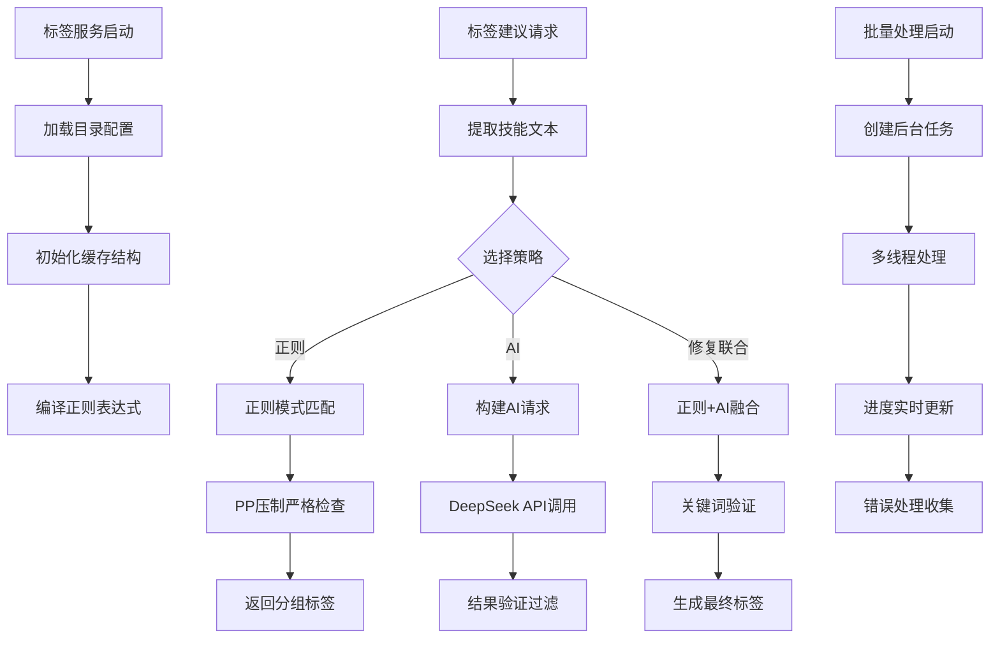
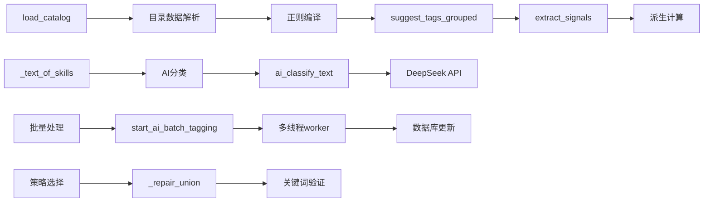

# 文件分析报告：server/app/services/tags_service.py

## 文件概述
这是一个高度复杂的标签智能分析服务模块，提供怪物技能的标签自动识别和分类功能。模块结合了正则表达式匹配、AI智能识别和策略选择机制，支持热更新目录加载、多种标签策略（正则/AI/修复联合），以及批量处理等高级功能。文件实现了完整的标签生态系统，从底层的目录管理到高层的AI接口调用。

## 代码结构分析

### 导入依赖
```python
from __future__ import annotations    # 类型注解前向兼容
import json, os, re, time, uuid, threading  # 标准库
from dataclasses import dataclass, field     # 数据类支持
from functools import lru_cache              # 缓存装饰器
from datetime import datetime, timezone      # 时间处理
from typing import List, Set, Dict, Tuple, Any, Optional, Callable  # 类型注解
from pathlib import Path                     # 路径处理

import httpx                                 # HTTP客户端（可选）
from sqlalchemy import select               # 数据库查询
from sqlalchemy.orm import selectinload     # 数据库关联加载
from ..models import Monster                # 怪物模型
```

### 全局变量和常量
```python
# 配置常量
_DEFAULT_CATALOG_PATH = "config/tags_catalog.json"  # 默认目录路径
TAGS_CATALOG_PATH: str                              # 目录文件路径
TAGS_CATALOG_TTL: float = 5.0                      # 目录缓存时间（秒）
TAG_WRITE_STRATEGY: str                             # 写入策略选择
TAG_AI_REPAIR_VERIFY: bool                          # AI修复验证开关

# AI配置
DEEPSEEK_API_URL: str                               # DeepSeek API地址
DEEPSEEK_MODEL: str = "deepseek-chat"              # 使用的AI模型
DEEPSEEK_API_KEY: str                               # API密钥

# 全局缓存对象
_CACHE = _CatalogCache()                            # 目录数据缓存实例
_registry = _BatchRegistry()                        # 批量任务注册表
```

### 配置和设置
- **目录管理**: 支持热更新的JSON目录加载，兼容新旧结构
- **缓存策略**: 基于文件修改时间的智能缓存机制
- **AI集成**: DeepSeek API调用配置，支持JSON响应格式
- **批量处理**: 多线程批量标签处理框架

## 函数详细分析

### 函数概览表
| 函数名 | 类型 | 参数 | 返回值 | 功能描述 |
|--------|------|------|--------|----------|
| `load_catalog()` | 公共函数 | force:bool | Dict[str,Any] | 加载和缓存标签目录数据 |
| `suggest_tags_grouped()` | 公共函数 | monster:Monster | Dict[str,List[str]] | 正则表达式标签建议（分组） |
| `suggest_tags_for_monster()` | 公共函数 | monster:Monster | List[str] | 正则表达式标签建议（平铺） |
| `ai_classify_text()` | 公共函数 | text:str | Dict[str,List[str]] | AI文本分类标签识别 |
| `ai_suggest_tags_for_monster()` | 公共函数 | monster:Monster | List[str] | AI怪物标签建议 |
| `extract_signals()` | 公共函数 | monster:Monster | Dict[str,object] | 提取派生信号数据 |
| `start_ai_batch_tagging()` | 公共函数 | ids:List[int], db_factory:Callable | str | 启动批量AI标签处理 |
| `get_ai_batch_progress()` | 公共函数 | job_id:str | Optional[Dict] | 获取批量任务进度 |
| `_pp_drain_strict()` | 私有函数 | text:str | bool | 严格PP压制检测 |
| `_build_ai_payload()` | 私有函数 | text:str | Dict[str,Any] | 构建AI请求负载 |

### 函数详细说明

#### `load_catalog(force: bool = False) -> Dict[str, Any]`
**功能**: 智能加载标签目录数据，支持热更新
- 基于文件修改时间的缓存机制
- 支持新旧目录结构兼容
- 线程安全的加载过程
- 自动编译正则表达式模式

#### `suggest_tags_grouped(monster: Monster) -> Dict[str, List[str]]`
**功能**: 基于正则表达式的分组标签建议
- 遍历所有技能文本进行模式匹配
- 返回按buff/debuff/special分类的标签
- 包含PP压制严格守卫机制

#### `ai_classify_text(text: str) -> Dict[str, List[str]]`
**功能**: 使用AI进行文本分类标签识别
- 调用DeepSeek API进行智能分析
- LRU缓存优化重复调用
- 严格的结果验证和过滤

#### `extract_signals(monster: Monster) -> Dict[str, object]`
**功能**: 提取用于派生计算的信号数据
- 分析进攻、生存、控制、节奏、压制五大维度
- 生成布尔/数值信号用于后续派生计算
- 支持复杂的正则匹配和逻辑判断

#### `start_ai_batch_tagging(ids: List[int], db_factory: Callable) -> str`
**功能**: 启动后台批量AI标签处理
- 多线程并发处理大量怪物数据
- 实时进度跟踪和错误处理
- 支持任务取消和状态监控

## 类详细分析

### 类概览表
| 类名 | 类型 | 继承关系 | 功能描述 |
|------|------|----------|----------|
| `_CatalogCache` | 缓存类 | object | 标签目录数据缓存容器 |
| `BatchJobState` | 数据类 | @dataclass | 批量任务状态管理 |
| `_BatchRegistry` | 注册类 | object | 批量任务注册和管理 |

### 类详细说明

#### `_CatalogCache`
**功能**: 标签目录的智能缓存容器
- 存储解析后的目录数据、编译的正则表达式
- 提供线程安全的数据访问
- 支持国际化映射和分类管理

#### `BatchJobState`
**功能**: 批量任务的完整状态跟踪
- 实时进度统计（总数/完成/失败）
- 错误信息收集和限制
- ETA计算和时间戳管理
- 支持任务取消和状态查询

#### `_BatchRegistry`
**功能**: 全局批量任务注册管理器
- 线程安全的任务创建和查询
- 支持任务取消和自动清理
- 提供完整的任务生命周期管理

## 函数调用流程图


## 变量作用域分析
- **模块级常量**: 配置路径、API密钥等全局配置
- **缓存作用域**: `_CACHE`对象提供全局数据缓存
- **任务注册作用域**: `_registry`管理所有批量任务状态
- **线程局部作用域**: 批量处理中的工作线程独立状态
- **函数缓存作用域**: LRU缓存装饰器提供函数级缓存

## 函数依赖关系


**核心依赖链**:
- 目录加载 → 模式编译 → 正则匹配 → 标签建议
- 文本提取 → AI请求构建 → API调用 → 结果验证
- 信号提取 → 派生计算接口
- 任务创建 → 线程管理 → 进度跟踪 → 状态更新

**架构特点**:
- **多策略支持**: 正则/AI/修复联合三种标签识别策略
- **高性能缓存**: 多层缓存机制优化重复计算
- **线程安全设计**: 支持并发访问和批量处理
- **错误容错机制**: 完善的异常处理和降级策略
- **热更新支持**: 目录文件变更自动重载
- **国际化友好**: 支持多语言标签映射