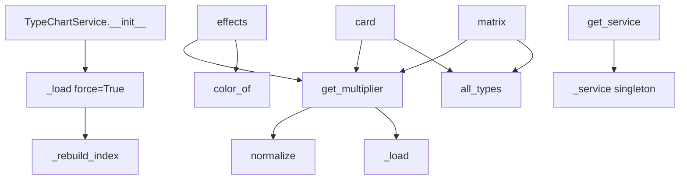

# 文件分析报告：types_service.py

## 文件概述
types_service.py 是一个专门处理怪物属性克制关系的服务类，提供了完整的属性系统管理功能。该文件实现了单例模式的 TypeChartService 类，负责加载和热更新 type_chart.json 配置文件，提供属性克制关系查询、矩阵生成、效果展示等多种功能，是系统中属性相关功能的核心服务。

## 代码结构分析

### 导入依赖
```python
from __future__ import annotations
from pathlib import Path
from typing import Dict, Any, List, Optional
import json
import threading
```

### 全局变量和常量
- `_DATA_DIR`: 数据目录路径，指向 server/app/data
- `_DEFAULT_JSON`: 默认配置文件路径，指向 type_chart.json
- `_service`: TypeChartService 的全局单例实例

### 配置和设置
- 默认配置文件路径：`server/app/data/type_chart.json`
- 支持文件热更新机制
- 线程安全的配置加载

## 函数详细分析

### 函数概览表

| 函数名 | 类型 | 参数数量 | 主要功能 |
|--------|------|----------|----------|
| `get_service` | 单例获取 | 0 | 获取 TypeChartService 实例 |
| `list_types` | 便捷函数 | 0 | 获取所有属性类型列表 |
| `get_chart` | 便捷函数 | 0 | 获取完整属性图表数据 |
| `get_effects` | 便捷函数 | 3 | 获取属性效果数据（排序版） |
| `get_card` | 便捷函数 | 1 | 获取单属性的完整克制卡片 |
| `get_matrix` | 便捷函数 | 1 | 获取属性克制矩阵 |

### 函数详细说明

#### 单例和便捷函数组
- **get_service()**：返回全局 TypeChartService 单例实例
- **list_types()**：直接调用服务实例的 all_types 方法
- **get_chart()**：获取完整的属性克制配置数据
- **get_effects()**：获取带排序的属性效果展示数据
- **get_card()**：获取单个属性的完整克制关系卡片
- **get_matrix()**：生成N×N的属性克制倍率矩阵

## 类详细分析

### 类概览表

| 类名 | 类型 | 主要功能 | 设计模式 |
|------|------|----------|----------|
| `TypeChartService` | 服务类 | 属性克制关系管理 | 单例模式 |

### 类详细说明

#### TypeChartService 类
**核心职责**：
- 加载和热更新 type_chart.json 配置文件
- 提供属性名称规范化功能（支持别名映射）
- 计算属性间的克制倍率关系
- 生成多种格式的属性数据（效果列表、卡片、矩阵）

**关键方法分析**：
- **__init__(json_path)**：初始化服务，设置文件路径和线程锁
- **_load(force=False)**：线程安全的配置文件加载，支持热更新检测
- **_rebuild_index()**：构建属性名称到规范名称的索引映射
- **normalize(type_name)**：属性名称规范化，处理"系"后缀和常见别名
- **get_multiplier(self_type, vs_type, perspective)**：核心倍率计算逻辑
- **color_of(multiplier)**：静态方法，根据倍率返回UI颜色（红/绿/黑）
- **effects(vs, perspective, sort)**：生成属性效果列表，支持排序
- **card(self_type)**：生成单属性的完整克制关系卡片，包含分桶展示
- **matrix(perspective)**：生成N×N属性克制矩阵，用于表格或热力图展示

## 函数调用流程图


## 变量作用域分析

### 模块级作用域
- 路径常量：`_DATA_DIR`, `_DEFAULT_JSON`
- 全局单例：`_service`
- 便捷函数：`list_types`, `get_chart`, `get_effects`, `get_card`, `get_matrix`

### 类级作用域
- **TypeChartService**：
  - 实例属性：`_path`, `_lock`, `_chart`, `_mtime`, `_index`
  - 方法作用域中的临时变量用于配置解析、索引构建、倍率计算等

### 线程安全管理
代码使用 `threading.Lock()` 确保配置文件加载和索引重建的线程安全性。

## 函数依赖关系

### 外部依赖
- **Python标准库**：pathlib（路径处理）、json（配置解析）、threading（线程安全）
- **类型提示**：typing模块的类型定义

### 内部依赖关系
1. **配置加载链**：`__init__` → `_load` → `_rebuild_index`
2. **倍率计算链**：`get_multiplier` → `normalize` + `_load`
3. **数据生成链**：`effects/card/matrix` → `get_multiplier` → `normalize`
4. **单例模式链**：便捷函数 → `get_service` → `_service`

### 数据流向
- 配置文件 → JSON解析 → 内存索引 → 倍率查询 → 格式化输出
- 支持热更新：文件修改检测 → 重新加载 → 索引重建 → 新数据生效
- 属性名称处理：原始输入 → 别名映射 → 规范化名称 → 数据库查询