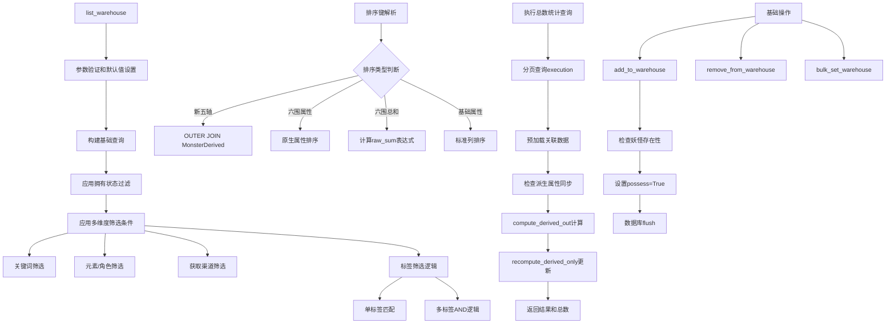

# 文件分析报告：server/app/services/warehouse_service.py

## 文件概述
这是妖怪仓库管理服务，提供完整的妖怪收藏管理功能，包括添加/移除妖怪、批量操作、统计查询和高级列表筛选。该服务支持基于拥有状态的过滤、多维度排序（包括新五轴派生属性）、分页查询和实时数据同步，是用户管理个人妖怪收藏的核心业务服务。

## 代码结构分析

### 导入依赖
```python
from typing import Iterable, List, Tuple, Optional
from sqlalchemy.orm import Session, selectinload
from sqlalchemy import select, func, asc, desc, or_
from ..models import Monster, MonsterSkill, Skill, Tag, MonsterDerived
from ..services.derive_service import compute_derived_out, recompute_derived_only
```

### 全局变量和常量
该文件没有定义全局常量，所有配置都通过函数参数传递。

### 配置和设置
- 默认分页大小：20条记录
- 最大分页大小限制：200条记录
- 支持多种排序方式：基础属性、六维属性、新五轴派生属性

## 函数详细分析

### 函数概览表
| 函数名 | 用途 | 输入参数 | 返回值 | 复杂度 |
|--------|------|----------|--------|--------|
| `add_to_warehouse` | 添加妖怪到仓库 | `db: Session, monster_id: int` | `bool` | O(1) |
| `remove_from_warehouse` | 从仓库移除妖怪 | `db: Session, monster_id: int` | `bool` | O(1) |
| `bulk_set_warehouse` | 批量设置拥有状态 | `db: Session, ids: Iterable[int], possess: bool` | `int` | O(n) |
| `warehouse_stats` | 仓库统计信息 | `db: Session` | `dict` | O(1) |
| `list_warehouse` | 仓库列表查询 | `db: Session, 多个筛选参数` | `Tuple[List[Monster], int]` | O(n log n) |

### 函数详细说明

**基础操作函数：**
- `add_to_warehouse(db, monster_id)`: 将指定妖怪添加到仓库
  - 通过设置Monster.possess=True标记为已拥有
  - 包含存在性检查和状态验证
  - 返回操作是否成功的布尔值
- `remove_from_warehouse(db, monster_id)`: 从仓库移除指定妖怪
  - 设置Monster.possess=False标记为未拥有
  - 安全的状态检查和数据库操作
- `bulk_set_warehouse(db, ids, possess)`: 批量设置妖怪拥有状态
  - 支持批量添加或移除操作
  - 自动去重处理，避免重复操作
  - 返回实际变更的妖怪数量

**统计查询函数：**
- `warehouse_stats(db)`: 生成仓库统计报告
  - 计算总妖怪数量、已拥有数量、未拥有数量
  - 提供兼容性字段`in_warehouse`
  - 使用SQL聚合函数提高查询效率

**核心列表查询函数：**
- `list_warehouse()`: 功能最丰富的查询函数，支持：
  - **拥有状态过滤**: `possess`参数控制显示已拥有/未拥有/全部
  - **多维度筛选**: 名称关键词、元素、角色、标签、获取渠道
  - **高级标签筛选**: 单标签匹配和多标签AND逻辑
  - **灵活排序系统**: 支持15+种排序方式
  - **智能分页**: 参数验证和边界限制
  - **关联数据预加载**: 优化数据库查询性能

## 类详细分析

### 类概览表
该文件主要包含函数定义，大量使用了外部模型类：
| 类名 | 来源 | 用途 | 核心操作 |
|------|------|------|----------|
| `Monster` | `models` | 妖怪实体 | possess状态管理 |
| `MonsterDerived` | `models` | 派生属性 | 五轴排序支持 |
| `Tag` | `models` | 标签实体 | 标签筛选查询 |
| `MonsterSkill` | `models` | 妖怪技能关联 | 技能数据预加载 |

### 类详细说明

**Monster类的使用模式：**
- possess字段：核心的拥有状态标识
- 基础属性用于筛选：element, role, type
- 六围属性用于排序：hp, speed, attack, defense, magic, resist
- 关联关系：tags用于标签筛选

**MonsterDerived类的集成：**
- 新五轴排序支持：body_defense, body_resist等
- OUTER JOIN确保无派生数据的妖怪也能显示
- 实时数据同步：自动更新过期的派生属性

## 函数调用流程图


## 变量作用域分析

**函数级作用域：**
- **list_warehouse函数内**：
  - `page, page_size`: 分页参数处理
  - `direction`: 排序方向函数(asc/desc)
  - `base`: SQLAlchemy查询构造器
  - `derived_map, raw_map`: 排序字段映射字典
  - `raw_sum_expr`: 六维总和计算表达式
  - `stmt`: 最终执行的查询语句
  - `items, total`: 查询结果和总数
- **bulk_set_warehouse函数内**：
  - `changed`: 变更计数器
  - `uniq_ids`: 去重后的ID列表
- **warehouse_stats函数内**：
  - `total, owned, not_owned`: 统计数值变量

**SQL表达式作用域：**
- 查询构造器：在函数内部逐步构建复杂查询
- 聚合表达式：func.count(), func.coalesce()等
- 关联查询：selectinload预加载表达式

## 函数依赖关系

**核心查询依赖链：**
1. `list_warehouse` → SQLAlchemy查询构造 → 数据库执行
2. 排序逻辑 → 字段映射 → SQL表达式构建
3. 筛选条件 → WHERE子句 → 查询优化

**数据同步依赖：**
- `list_warehouse` → `compute_derived_out` → `recompute_derived_only`
- 派生属性计算 → derive_service模块 → MonsterDerived更新

**性能优化依赖：**
- `selectinload` → 关联数据预加载 → N+1查询避免
- 子查询计数 → 分页总数计算 → 查询性能优化

**业务逻辑依赖：**
- 拥有状态管理 → Monster.possess字段 → 仓库概念实现
- 标签筛选 → Tag多对多关系 → 灵活分类系统

**查询优化特性：**
- **预加载关联**: 使用selectinload避免N+1查询问题
- **子查询计数**: 通过子查询获取精确的分页总数
- **条件索引**: 基于索引字段的高效筛选
- **批量操作**: 减少数据库交互次数
- **实时同步**: 确保派生数据的一致性

**扩展性设计：**
- **参数化查询**: 通过参数控制各种筛选和排序选项
- **兼容性支持**: 保留历史字段和别名映射
- **灵活排序**: 支持基础属性、计算属性和派生属性
- **分页控制**: 合理的分页限制和边界处理

该服务体现了现代Web应用中复杂查询服务的设计模式，通过SQLAlchemy ORM的高级特性，实现了高性能、高灵活性的数据查询和管理功能。