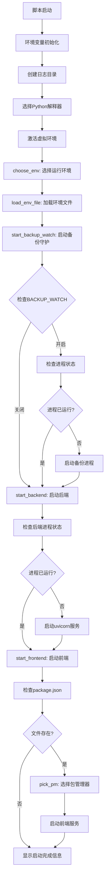

# 文件分析报告：start-bg.sh

## 文件概述

`start-bg.sh` 是一个全功能的后台启动脚本，用于启动 KBXY Monsters Pro 项目的完整开发或测试环境。该脚本集成了环境选择、后端服务、前端应用和数据库备份守护进程的启动功能，支持灵活的配置管理。

## 代码结构分析

### 导入依赖

```bash
#!/usr/bin/env bash
set -euo pipefail
```
- 使用 bash 解释器执行
- 启用严格模式：遇到错误停止执行（-e），未定义变量报错（-u），管道错误传播（-o pipefail）

### 全局变量和常量

```bash
# 项目路径配置
ROOT_DEFAULT="/Users/martinezdavid/Documents/MG/code/kbxy-monsters-pro"
ROOT="${ROOT:-$ROOT_DEFAULT}"
VENV_DIR="${VENV_DIR:-$ROOT/.venv}"
SERVER_DIR="${SERVER_DIR:-$ROOT/server}"
CLIENT_DIR="${CLIENT_DIR:-$ROOT/client}"

# 服务配置
BACKEND_HOST="${BACKEND_HOST:-0.0.0.0}"
BACKEND_PORT="${BACKEND_PORT:-8000}"
FRONTEND_PORT="${FRONTEND_PORT:-5173}"

# 日志配置
LOG_DIR="${LOG_DIR:-$ROOT/.logs}"
PKG_MGR="${PKG_MGR:-}"

# 备份配置
BACKUP_WATCH="${BACKUP_WATCH:-1}"
BACKUP_CHANGE_KEEP_MAX="${BACKUP_CHANGE_KEEP_MAX:-20}"
BACKUP_RETENTION_DAYS="${BACKUP_RETENTION_DAYS:-30}"
BACKUP_POLL_INTERVAL="${BACKUP_POLL_INTERVAL:-2.0}"
BACKUP_MIN_CHANGE_INTERVAL="${BACKUP_MIN_CHANGE_INTERVAL:-2.0}"
```

### 配置和设置

脚本支持通过环境变量进行灵活配置：
- 路径配置：项目根目录、虚拟环境、服务器和客户端目录
- 网络配置：后端监听地址和端口、前端端口
- 备份配置：备份开关、保留策略、轮询间隔等

## 函数详细分析

### 函数概览表

| 函数名 | 参数 | 返回值 | 主要功能 |
|---------|------|--------|----------|
| `running` | pidfile路径 | 0/1状态码 | 检查进程是否运行 |
| `pick_pm` | 无 | 包管理器名称 | 自动选择包管理器 |
| `choose_env` | 无 | 设置APP_ENV | 交互式环境选择 |
| `load_env_file` | 无 | 无 | 加载环境配置文件 |
| `start_backup_watch` | 无 | 无 | 启动备份守护进程 |
| `start_backend` | 无 | 无 | 启动后端服务 |
| `start_frontend` | 无 | 无 | 启动前端服务 |

### 函数详细说明

#### `running(pidfile)`
```bash
running() {
  local pidfile="$1"
  [[ -f "$pidfile" ]] && ps -p "$(cat "$pidfile")" >/dev/null 2>&1
}
```
- **功能**：检查指定PID文件对应的进程是否在运行
- **参数**：PID文件路径
- **逻辑**：读取PID文件内容，使用ps命令验证进程存在性

#### `pick_pm()`
```bash
pick_pm() {
  if [[ -n "$PKG_MGR" ]]; then
    echo "$PKG_MGR"; return 0
  fi
  for pm in pnpm yarn npm bun; do
    if command -v "$pm" >/dev/null 2>&1; then
      echo "$pm"; return 0
    fi
  done
  echo "npm"
}
```
- **功能**：自动检测并选择可用的包管理器
- **优先级**：环境变量指定 > pnpm > yarn > npm > bun > 默认npm

#### `choose_env()`
```bash
choose_env() {
  echo "请选择启动环境："
  echo "  [1] dev  （开发环境）"
  echo "  [2] test （测试环境）"
  read -rp "请输入数字 (1/2): " choice
  case "${choice:-}" in
    1) APP_ENV="dev" ;;
    2) APP_ENV="test" ;;
    *) echo "[ERR] 无效选择：$choice"; exit 1 ;;
  esac
  export APP_ENV
}
```
- **功能**：提供交互式环境选择界面
- **支持环境**：dev（开发）、test（测试）

#### `start_backup_watch()`
- **功能**：启动SQLite数据库备份守护进程
- **特性**：
  - 检查备份开关状态
  - 验证进程运行状态避免重复启动
  - 支持DATABASE_URL检测（外部数据库跳过备份）
  - 后台运行备份监控脚本

#### `start_backend()`
- **功能**：启动FastAPI后端服务
- **配置**：
  - 使用uvicorn作为ASGI服务器
  - 支持热重载（--reload）
  - 排除虚拟环境和缓存目录的监控
  - 可配置环境文件加载

#### `start_frontend()`
- **功能**：启动前端开发服务器
- **特性**：
  - 自动检测package.json存在性
  - 使用选择的包管理器运行开发命令
  - 支持端口配置

## 类详细分析

### 类概览表
该脚本为纯Bash脚本，不包含类定义。

### 类详细说明
不适用。

## 函数调用流程图



## 变量作用域分析

### 全局变量
- **配置变量**：ROOT, VENV_DIR, SERVER_DIR, CLIENT_DIR, LOG_DIR 等
- **服务变量**：BACKEND_HOST, BACKEND_PORT, FRONTEND_PORT
- **备份变量**：BACKUP_WATCH, BACKUP_CHANGE_KEEP_MAX 等
- **运行时变量**：APP_ENV, PKG_MGR, PYTHON_BIN

### 函数局部变量
- `running()`: pidfile
- `pick_pm()`: pm (循环变量)
- `choose_env()`: choice
- `start_*()`: pidf, cmd, env_file 等

## 函数依赖关系

### 外部依赖
- `ps` 命令（进程检查）
- `uvicorn`（后端服务器）
- Python 虚拟环境
- Node.js 包管理器（pnpm/yarn/npm/bun）
- 备份脚本 `scripts/backup_sqlite.py`

### 内部依赖关系
```
main execution flow
├── choose_env()
├── load_env_file()
├── start_backup_watch()
│   └── running() 
├── start_backend()
│   └── running()
└── start_frontend()
    ├── pick_pm()
    └── running()
```

### 数据流分析
1. **配置加载流**：环境变量 → 默认值覆盖 → 函数使用
2. **服务启动流**：进程检查 → 避免重复启动 → 后台启动 → PID记录
3. **日志流**：各服务输出 → 重定向到日志文件 → 统一管理

### 错误处理
- **严格模式**：set -euo pipefail 确保错误快速失败
- **文件检查**：启动前验证必要文件存在性
- **进程检查**：避免重复启动服务
- **用户输入验证**：环境选择输入验证

### 性能分析
- **并发启动**：各服务独立后台启动，无串行等待
- **资源检查**：启动前检查进程状态，避免资源冲突
- **轻量级检查**：使用shell内置命令进行快速检查

### 算法复杂度
- **时间复杂度**：O(1) - 线性执行流程
- **空间复杂度**：O(1) - 固定变量存储

### 扩展性评估
- **配置扩展**：通过环境变量轻松扩展配置选项
- **服务扩展**：可添加新的启动函数支持更多服务
- **环境扩展**：可添加更多环境类型（如staging、production）

### 代码质量评估
- **可读性**：良好的函数分离和注释
- **可维护性**：模块化设计便于维护
- **健壮性**：完善的错误处理和状态检查
- **可配置性**：广泛的环境变量支持

### 文档完整性
脚本包含清晰的功能注释和配置说明，便于理解和使用。

### 备注
该脚本是项目启动的核心工具，支持开发和测试环境的完整启动流程，集成了备份、监控等运维功能。