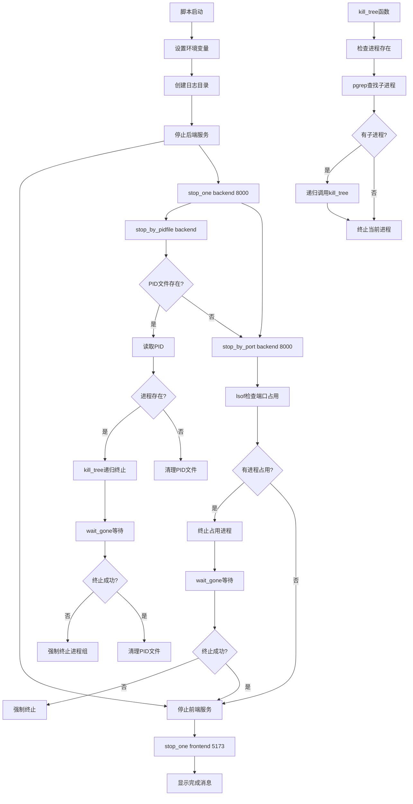

# 文件分析报告：stop-bg.sh

## 文件概述

`stop-bg.sh` 是一个专业的进程管理脚本，用于优雅地停止后台运行的前后端服务。该脚本实现了多层次的进程终止策略，支持PID文件管理、端口占用检测和进程树递归清理，确保所有相关进程都能被正确终止。

## 代码结构分析

### 导入依赖

```bash
#!/usr/bin/env bash
set -euo pipefail
```
- **Bash解释器**：使用env方式提高兼容性
- **严格模式**：错误时退出（-e）、未定义变量报错（-u）、管道错误传播（-o pipefail）

### 全局变量和常量

```bash
ROOT_DEFAULT="/Users/martinezdavid/Documents/MG/code/kbxy-monsters-pro"
ROOT="${ROOT:-$ROOT_DEFAULT}"
LOG_DIR="${LOG_DIR:-$ROOT/.logs}"
```

- **项目路径**：可通过环境变量覆盖的根目录配置
- **日志目录**：PID文件和日志的存储位置
- **环境变量支持**：ROOT和LOG_DIR支持外部配置

### 配置和设置

#### 默认配置参数
- **后端端口**：8000（可配置）
- **前端端口**：5173（可配置）
- **进程等待时间**：5秒（10次 × 0.5秒）
- **终止策略**：优雅终止 → 强制终止

## 函数详细分析

### 函数概览表

| 函数名 | 参数 | 返回值 | 主要功能 |
|---------|------|--------|----------|
| `kill_tree` | pid | 0/1状态码 | 递归杀死进程树 |
| `wait_gone` | check_cmd | 0/1状态码 | 等待进程终止 |
| `stop_by_pidfile` | name | 0/1状态码 | 通过PID文件停止进程 |
| `stop_by_port` | desc, port | 0/1状态码 | 通过端口停止进程 |
| `stop_one` | name, port | 无 | 综合停止策略 |

### 函数详细说明

#### `kill_tree(pid)` - 递归进程树终止
```bash
kill_tree() {
  local pid="$1"
  if [[ -z "${pid:-}\" ]] || ! ps -p "$pid" >/dev/null 2>&1; then
    return 0
  fi
  local kids
  kids="$(pgrep -P "$pid" || true)"
  if [[ -n "$kids" ]]; then
    for k in $kids; do
      kill_tree "$k"
    done
  fi
  kill "$pid" 2>/dev/null || true
}
```

**核心特性**：
- **递归设计**：深度优先遍历进程树
- **安全检查**：验证进程存在性避免错误
- **子进程处理**：使用pgrep查找子进程
- **错误容忍**：kill失败不会中断执行

**算法复杂度**：O(n) - n为进程树节点数量

#### `wait_gone(check_cmd)` - 进程终止等待
```bash
wait_gone() {
  local check_cmd="$1"
  local tries=10
  while ((tries-- > 0)); do
    if eval "$check_cmd"; then
      sleep 0.5
    else
      return 0
    fi
  done
  return 1
}
```

**设计特点**：
- **可配置检查**：接受任意命令字符串作为检查条件
- **超时机制**：最多等待5秒（10 × 0.5）
- **轮询策略**：0.5秒间隔的状态检查
- **返回状态**：0表示成功终止，1表示超时

#### `stop_by_pidfile(name)` - PID文件管理停止
```bash
stop_by_pidfile() {
  local name="$1"
  local pidf="$LOG_DIR/$name.pid"
  if [[ ! -f "$pidf" ]]; then
    echo "[INFO] 未找到 $name 的 pid 文件：$pidf"
    return 1
  fi
  local pid
  pid="$(cat "$pidf" 2>/dev/null || true)"
  if [[ -z "${pid:-}" ]] || ! ps -p "$pid" >/dev/null 2>&1; then
    echo "[INFO] $name 的 pid($pid) 不在运行，清理 pid 文件。"
    rm -f "$pidf"
    return 1
  fi
  # ...终止逻辑
}
```

**管理策略**：
- **文件存在检查**：验证PID文件是否存在
- **PID有效性检查**：确认进程仍在运行
- **清理机制**：移除无效的PID文件
- **两阶段终止**：优雅终止 + 强制终止

#### `stop_by_port(desc, port)` - 端口占用停止
```bash
stop_by_port() {
  local desc="$1" port="$2"
  local pids
  pids="$(lsof -ti tcp:"$port" 2>/dev/null || true)"
  if [[ -z "$pids" ]]; then
    echo "[INFO] 端口 $port 没有 $desc 在监听。"
    return 1
  fi
  # ...终止逻辑
}
```

**检测机制**：
- **lsof工具**：查找占用指定端口的进程
- **TCP端口检查**：专门检查TCP协议端口
- **多进程处理**：支持多个进程占用同一端口的情况
- **兜底策略**：当PID文件失效时的备选方案

#### `stop_one(name, port)` - 综合停止策略
```bash
stop_one() {
  local name="$1" port="${2:-}"
  stop_by_pidfile "$name" || true
  if [[ -n "$port" ]]; then
    stop_by_port "$name" "$port" || true
  fi
}
```

**双重保障**：
- **主要策略**：基于PID文件的精确停止
- **备选策略**：基于端口的兜底检查
- **错误容忍**：任一策略失败不影响另一策略执行

## 类详细分析

### 类概览表
该脚本为纯Bash脚本，不包含类定义。

### 类详细说明
不适用。

## 函数调用流程图



## 变量作用域分析

### 全局作用域
- **ROOT, LOG_DIR**：项目路径配置变量
- **环境变量支持**：可通过外部环境覆盖

### 函数局部作用域
#### `kill_tree`函数
- **pid**：目标进程ID
- **kids**：子进程ID列表
- **递归调用栈**：每层递归维护独立的变量空间

#### `wait_gone`函数
- **check_cmd**：检查命令字符串
- **tries**：重试计数器

#### `stop_by_*`函数
- **name/desc**：服务名称/描述
- **port**：端口号
- **pid/pids**：进程ID变量
- **pidf**：PID文件路径

## 函数依赖关系

### 外部依赖
- **系统命令**：ps, pgrep, kill, lsof, cat, rm
- **Shell内置**：echo, sleep, eval
- **文件系统**：PID文件读写操作

### 内部依赖关系
```
main execution flow
├── stop_one("backend", "8000")
│   ├── stop_by_pidfile("backend")
│   │   ├── kill_tree(pid)
│   │   │   └── kill_tree(child_pid) [递归]
│   │   ├── wait_gone("ps -p $pid")
│   │   └── kill -9 -$pid [强制终止]
│   └── stop_by_port("backend", "8000")
│       ├── lsof -ti tcp:8000
│       ├── kill $pids
│       └── wait_gone("lsof -ti tcp:8000")
└── stop_one("frontend", "5173")
    └── [同上结构]
```

### 数据流分析

#### 进程发现流程
1. **PID文件读取** → PID提取 → 进程存在性验证
2. **端口扫描** → 占用进程发现 → 进程列表获取

#### 进程终止流程
1. **优雅终止** → TERM信号发送 → 等待进程退出
2. **强制终止** → KILL信号发送 → 进程组终止

#### 清理流程
1. **PID文件清理** → 无效文件删除
2. **状态验证** → 最终状态确认

### 错误处理

#### 进程不存在处理
```bash
if [[ -z "${pid:-}" ]] || ! ps -p "$pid" >/dev/null 2>&1; then
  echo "[INFO] $name 的 pid($pid) 不在运行，清理 pid 文件。"
  rm -f "$pidf"
  return 1
fi
```
- **空PID检查**：处理文件读取失败或空文件
- **进程存在性检查**：使用ps命令验证进程状态
- **清理机制**：删除过期的PID文件

#### 命令执行容错
```bash
pids="$(lsof -ti tcp:"$port" 2>/dev/null || true)"
kill "$pid" 2>/dev/null || true
```
- **静默错误**：重定向stderr避免错误输出
- **继续执行**：使用`|| true`确保脚本不因单个命令失败而退出

#### 超时处理
- **wait_gone函数**：实现带超时的等待机制
- **重试策略**：10次重试，总计5秒超时
- **降级处理**：超时后执行强制终止

### 性能分析

#### 时间复杂度
- **进程树遍历**：O(n) - n为进程树节点数量
- **端口检查**：O(1) - lsof单次系统调用
- **等待循环**：O(1) - 固定次数的轮询

#### 空间复杂度
- **递归调用**：O(d) - d为进程树深度
- **变量存储**：O(1) - 固定的局部变量

#### 执行效率
- **并发处理**：不同服务的停止操作顺序执行
- **早期退出**：进程已停止时跳过后续操作
- **系统调用优化**：最小化不必要的系统调用

### 算法复杂度

#### 进程树遍历算法
- **深度优先搜索**：确保子进程先于父进程终止
- **递归实现**：代码简洁，逻辑清晰
- **终止顺序**：避免僵尸进程产生

#### 等待算法
- **指数退避策略**：固定间隔的轮询等待
- **条件检查**：灵活的命令字符串执行
- **超时保护**：避免无限等待

### 扩展性评估

#### 服务扩展性
- **配置化服务列表**：易于添加新的服务停止配置
- **端口参数化**：支持不同端口的服务配置
- **命名约定**：统一的PID文件命名便于管理

#### 功能扩展性
- **信号类型扩展**：可扩展不同的终止信号策略
- **等待策略扩展**：可自定义等待时间和重试次数
- **监控集成**：可集成服务监控和告警机制

#### 平台扩展性
- **跨平台兼容**：基于POSIX标准的命令和操作
- **工具依赖检查**：可添加必需工具的存在性检查
- **容器环境适配**：支持容器化部署环境

### 代码质量评估

#### 可读性
- **清晰的函数命名**：函数名称准确表达功能意图
- **合理的代码结构**：逻辑分层明确，职责分离
- **详细的输出信息**：用户友好的执行过程反馈

#### 可维护性
- **模块化设计**：每个函数职责单一，便于修改
- **配置外部化**：关键参数支持环境变量配置
- **错误信息明确**：便于问题诊断和调试

#### 健壮性
- **多重保障机制**：PID文件 + 端口检查的双重策略
- **优雅降级**：优雅终止失败后自动强制终止
- **完善的错误处理**：各种异常情况都有相应处理

#### 可测试性
- **函数化设计**：单个函数可独立测试
- **状态检查**：可验证的执行结果
- **日志输出**：便于测试验证和问题排查

### 文档完整性

脚本包含清晰的输出信息和操作提示，便于用户理解执行过程。

### 备注

这是一个设计精良的进程管理脚本，实现了多层次的进程终止策略。代码健壮性强，错误处理完善，适用于生产环境的服务管理需求。与`start-bg.sh`形成完整的服务生命周期管理工具链。