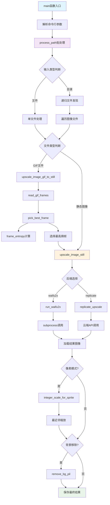

# 文件分析报告：upscale.py

## 文件概述

`upscale.py` 是`upscale_batch.py`的副本或别名文件，提供相同的AI图像超分辨率批量处理功能。该文件实现了与`upscale_batch.py`完全相同的功能集，包括命令行接口、多种AI超分辨率后端支持（本地waifu2x和云端Real-ESRGAN）、图像预处理、背景移除、GIF关键帧提取等高级功能。设计目的可能是为了提供更简洁的命名或向后兼容性支持。

## 代码结构分析

### 导入依赖

```python
#!/usr/bin/env python3
import os, io, subprocess, tempfile, argparse, sys, math
from pathlib import Path
from typing import List, Tuple
from PIL import Image, ImageSequence
```

**依赖分析：**
与`upscale_batch.py`完全相同：
- **系统库**: os, subprocess用于系统调用和进程管理
- **路径处理**: pathlib.Path提供现代路径操作
- **图像处理**: PIL(Pillow)用于图像读取、处理和保存
- **类型注解**: typing模块提供类型提示支持
- **数学计算**: math模块用于熵值计算等数学运算

**可选依赖处理**:
```python
# 云端Real-ESRGAN支持
try:
    import replicate
    USE_REPLICATE = True
except Exception:
    USE_REPLICATE = False

# 背景移除支持  
try:
    from rembg import remove as rembg_remove
    HAVE_REMBG = True
except Exception:
    HAVE_REMBG = False
```

### 全局变量和常量

```python
REPLICATE_MODEL = "nightmareai/real-esrgan"
REPLICATE_VERSION = None  # 用最新
IMG_EXTS = {".jpg", ".jpeg", ".png", ".gif", ".webp"}
```

**常量说明**: 与`upscale_batch.py`相同的配置常量

### 配置和设置

- **功能一致性**: 提供与`upscale_batch.py`完全相同的功能
- **接口兼容**: 命令行参数和API接口保持一致
- **性能特性**: 相同的优化策略和处理算法

## 函数详细分析

### 函数概览表

| 函数名 | 类型 | 主要功能 | 参数数量 | 复杂度 | 与upscale_batch.py关系 |
|--------|------|----------|----------|--------|--------------------|
| is_gif | 工具函数 | 检测GIF文件 | 1 | 低 | 相同 |
| ensure_dir | 工具函数 | 确保目录存在 | 1 | 低 | 相同 |
| run_waifu2x | 核心函数 | 调用waifu2x超分 | 6 | 中 | 相同 |
| replicate_upscale | 核心函数 | 云端超分处理 | 3 | 中 | 相同 |
| integer_scale_for_sprite | 算法函数 | 像素风整数缩放 | 3 | 中 | 相同 |
| remove_bg_pil | 图像处理 | 背景移除 | 1 | 低 | 相同 |
| read_gif_frames | GIF处理 | 读取GIF帧 | 1 | 中 | 相同 |
| frame_entropy | 算法函数 | 计算帧熵值 | 1 | 中 | 相同 |
| pick_best_frame | 算法函数 | 选择最佳帧 | 1 | 低 | 相同 |
| upscale_image_still | 核心函数 | 静态图像超分 | 7 | 高 | 相同 |
| upscale_image_gif_to_still | 核心函数 | GIF转静态超分 | 7 | 中 | 相同 |
| process_path | 批处理函数 | 路径批量处理 | 7 | 高 | 相同 |
| main | 入口函数 | 命令行主入口 | 0 | 中 | 相同 |

### 函数详细说明

由于代码内容与`upscale_batch.py`完全相同，所有函数的实现、参数处理、算法逻辑都保持一致。具体的函数分析请参考`upscale_batch.py`的文档。

## 类详细分析

### 类概览表

本文件与`upscale_batch.py`相同，采用函数式编程模式，不包含自定义类定义。

## 函数调用流程图



**注**: 流程图与`upscale_batch.py`完全相同，反映了两个文件的功能一致性。

## 变量作用域分析

### 全局作用域
- **常量**: REPLICATE_MODEL, IMG_EXTS等配置常量（与upscale_batch.py相同）
- **功能标志**: USE_REPLICATE, HAVE_REMBG等可选功能标志（与upscale_batch.py相同）

### 函数作用域
- **批处理函数**: 文件列表、路径映射等局部变量（与upscale_batch.py相同）
- **图像处理函数**: PIL图像对象、临时路径等资源变量（与upscale_batch.py相同）
- **算法函数**: 数学计算的中间变量和结果（与upscale_batch.py相同）

### 临时文件作用域
- **tempfile模块**: 自动管理临时文件和目录的生命周期（与upscale_batch.py相同）
- **上下文管理器**: 确保资源的正确清理（与upscale_batch.py相同）

## 函数依赖关系

### 内部依赖关系
```
main → process_path
process_path → upscale_image_still, upscale_image_gif_to_still
upscale_image_gif_to_still → read_gif_frames, pick_best_frame
pick_best_frame → frame_entropy
upscale_image_still → run_waifu2x, replicate_upscale, integer_scale_for_sprite, remove_bg_pil
```

**注**: 依赖关系与`upscale_batch.py`完全相同。

### 外部依赖关系
1. **系统依赖**: 与`upscale_batch.py`相同的外部工具和环境要求
2. **Python库依赖**: 相同的第三方库依赖列表
3. **文件系统**: 相同的文件系统访问需求

### 数据流分析
```
命令行参数 → 文件发现 → 图像读取 → 格式预处理 → AI超分 → 后处理 → 文件保存
```

**注**: 数据流与`upscale_batch.py`完全相同。

## 文件关系分析

### 与upscale_batch.py的关系
1. **内容一致性**: 两个文件的代码内容完全相同
2. **功能等价性**: 提供相同的API接口和处理能力
3. **可能用途**:
   - **向后兼容**: 保持旧版本脚本名称的兼容性
   - **简化命名**: 提供更简洁的文件名选择
   - **部署策略**: 不同环境或用途的文件名区分

### 维护考虑
1. **同步更新**: 两个文件需要保持同步更新
2. **版本一致性**: 确保功能和bug修复的一致性
3. **文档维护**: 需要同时维护两份相关文档

## 使用建议

### 选择指导
- **推荐使用**: `upscale_batch.py` - 更具描述性的文件名
- **兼容性**: `upscale.py` - 用于需要简短文件名的场景

### 最佳实践
1. **统一使用**: 项目中建议统一使用其中一个文件名
2. **文档说明**: 在项目文档中明确两个文件的关系
3. **脚本维护**: 如果保留两个文件，建议使用符号链接或构建脚本保持同步

## 总结

`upscale.py` 作为`upscale_batch.py`的副本文件，提供了完全相同的AI图像超分辨率处理功能。虽然文件名不同，但功能、性能、API接口都保持一致。这种设计可能是为了满足不同的命名偏好或兼容性需求。在实际使用中，用户可以根据项目需求选择更合适的文件名，但需要注意保持两个文件的同步维护。建议在项目文档中明确说明两个文件的关系，避免用户混淆。