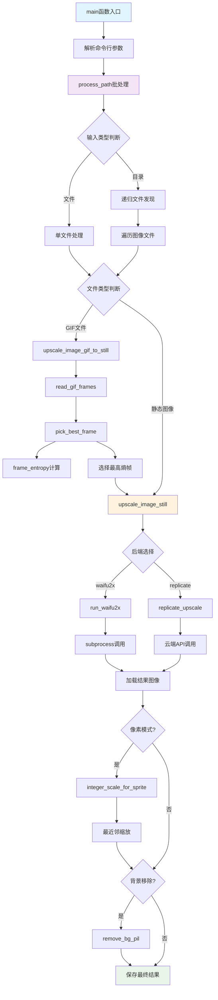

# 文件分析报告：upscale_batch.py

## 文件概述

`upscale_batch.py` 是一个专业的AI图像超分辨率批量处理工具，提供命令行接口用于批量提升图像质量和分辨率。该文件实现了多种AI超分辨率后端支持（本地waifu2x和云端Real-ESRGAN），集成了图像预处理、背景移除、GIF关键帧提取等高级功能。设计注重像素艺术优化和批量处理效率，为图像质量提升工作流提供完整的解决方案。

## 代码结构分析

### 导入依赖

```python
#!/usr/bin/env python3
import os, io, subprocess, tempfile, argparse, sys, math
from pathlib import Path
from typing import List, Tuple
from PIL import Image, ImageSequence
```

**依赖分析：**
- **系统库**: os, subprocess用于系统调用和进程管理
- **路径处理**: pathlib.Path提供现代路径操作
- **图像处理**: PIL(Pillow)用于图像读取、处理和保存
- **类型注解**: typing模块提供类型提示支持
- **数学计算**: math模块用于熵值计算等数学运算

**可选依赖模块:**
```python
# 云端Real-ESRGAN支持
try:
    import replicate
    USE_REPLICATE = True
except Exception:
    USE_REPLICATE = False

# 背景移除支持
try:
    from rembg import remove as rembg_remove
    HAVE_REMBG = True
except Exception:
    HAVE_REMBG = False
```

### 全局变量和常量

```python
REPLICATE_MODEL = "nightmareai/real-esrgan"
REPLICATE_VERSION = None  # 用最新
IMG_EXTS = {".jpg", ".jpeg", ".png", ".gif", ".webp"}
```

**常量分析：**
- `REPLICATE_MODEL`: 云端Real-ESRGAN模型标识符
- `REPLICATE_VERSION`: 模型版本控制，None表示使用最新版本
- `IMG_EXTS`: 支持的图像文件扩展名集合

### 配置和设置

- **多后端支持**: 本地waifu2x-ncnn-vulkan和云端Replicate服务
- **图像格式兼容**: 支持主流图像格式和GIF动画
- **像素艺术优化**: 专门针对像素风格图像的处理策略
- **批量处理**: 支持单文件和目录递归处理

## 函数详细分析

### 函数概览表

| 函数名 | 类型 | 主要功能 | 参数数量 | 复杂度 |
|--------|------|----------|----------|--------|
| is_gif | 工具函数 | 检测GIF文件 | 1 | 低 |
| ensure_dir | 工具函数 | 确保目录存在 | 1 | 低 |
| run_waifu2x | 核心函数 | 调用waifu2x超分 | 6 | 中 |
| replicate_upscale | 核心函数 | 云端超分处理 | 3 | 中 |
| integer_scale_for_sprite | 算法函数 | 像素风整数缩放 | 3 | 中 |
| remove_bg_pil | 图像处理 | 背景移除 | 1 | 低 |
| read_gif_frames | GIF处理 | 读取GIF帧 | 1 | 中 |
| frame_entropy | 算法函数 | 计算帧熵值 | 1 | 中 |
| pick_best_frame | 算法函数 | 选择最佳帧 | 1 | 低 |
| upscale_image_still | 核心函数 | 静态图像超分 | 7 | 高 |
| upscale_image_gif_to_still | 核心函数 | GIF转静态超分 | 7 | 中 |
| process_path | 批处理函数 | 路径批量处理 | 7 | 高 |
| main | 入口函数 | 命令行主入口 | 0 | 中 |

### 函数详细说明

#### `run_waifu2x(src, dst_png, scale, noise, model, jobs, tile)`
**功能**: 调用本地waifu2x-ncnn-vulkan进行图像超分辨率处理
**参数处理**:
- `src`: 输入图像路径
- `dst_png`: 输出PNG路径（统一格式）
- `scale`: 放大倍率（2, 3, 4）
- `noise`: 降噪级别（-1为默认）
- `model`: 模型类型（models-cunet）
- `jobs`: 线程配置（如"2:2:2"）
- `tile`: 瓦片大小（防显存溢出）

**实现细节**:
```python
cmd = ["waifu2x-ncnn-vulkan", "-i", str(src), "-o", str(dst_png), 
       "-s", str(scale), "-n", str(noise), "-m", model, "-f", "png"]
if jobs: cmd += ["-j", jobs]
if tile: cmd += ["-t", str(tile)]
subprocess.run(cmd, check=True, stdout=subprocess.PIPE, stderr=subprocess.PIPE)
```

#### `replicate_upscale(pil_im, scale, face_enhance)`
**功能**: 使用云端Real-ESRGAN服务进行图像超分
**云端处理流程**:
1. **图像编码**: 将PIL图像编码为PNG字节流
2. **API调用**: 通过Replicate客户端提交处理请求
3. **结果下载**: 从返回URL下载处理结果
4. **格式转换**: 转换为适当的颜色模式

**错误处理**: 检查REPLICATE_API_TOKEN和网络连接状态

#### `integer_scale_for_sprite(w, h, target_scale, max_mul)`
**功能**: 为像素艺术计算最佳整数缩放倍率
**算法逻辑**:
```python
for mul in range(min(max_mul, target_scale), 1, -1):
    if target_scale % mul == 0:
        return mul
return 2 if target_scale >= 2 else 1
```
**优化目标**: 保持像素艺术的锐利边缘，避免插值模糊

#### `frame_entropy(img)`
**功能**: 计算图像帧的信息熵，用于选择最佳代表帧
**熵值计算**:
```python
hist = img.convert("L").histogram()
total = sum(hist)
ent = 0.0
for c in hist:
    if c:
        p = c / total
        ent -= p * math.log2(p)
```
**应用价值**: 熵值高的帧通常包含更多细节信息

#### `upscale_image_still(src, dst_png, backend, scale, pixel_mode, remove_bg_flag, waifu_jobs, waifu_tile)`
**功能**: 静态图像超分辨率处理的核心函数
**处理流程**:
1. **后端选择**: 根据backend参数选择waifu2x或replicate
2. **像素模式**: 如果启用像素模式，先进行整数倍最近邻缩放
3. **超分处理**: 应用AI超分辨率算法
4. **后处理**: 可选的背景移除处理
5. **格式统一**: 输出为PNG格式保证质量

#### `process_path(in_path, out_dir, backend, scale, pixel_mode, remove_bg_flag, waifu_jobs, waifu_tile)`
**功能**: 批量处理入口，支持文件和目录处理
**批处理逻辑**:
- **目录处理**: 递归遍历所有支持的图像文件
- **路径映射**: 保持相对路径结构
- **格式转换**: GIF转换为静态PNG
- **并发安全**: 使用临时目录避免冲突

## 类详细分析

### 类概览表

本文件采用函数式编程模式，不包含自定义类定义。主要依赖PIL.Image和pathlib.Path等内置类。

## 函数调用流程图



## 变量作用域分析

### 全局作用域
- **常量**: REPLICATE_MODEL, IMG_EXTS等配置常量
- **功能标志**: USE_REPLICATE, HAVE_REMBG等可选功能标志

### 函数作用域
- **批处理函数**: 文件列表、路径映射等局部变量
- **图像处理函数**: PIL图像对象、临时路径等资源变量
- **算法函数**: 数学计算的中间变量和结果

### 临时文件作用域
- **tempfile模块**: 自动管理临时文件和目录的生命周期
- **上下文管理器**: 确保资源的正确清理

## 函数依赖关系

### 内部依赖关系
```
main → process_path
process_path → upscale_image_still, upscale_image_gif_to_still
upscale_image_gif_to_still → read_gif_frames, pick_best_frame
pick_best_frame → frame_entropy
upscale_image_still → run_waifu2x, replicate_upscale, integer_scale_for_sprite, remove_bg_pil
```

### 外部依赖关系
1. **系统依赖**:
   - waifu2x-ncnn-vulkan: 本地AI超分辨率引擎
   - REPLICATE_API_TOKEN: 云端服务认证
2. **Python库依赖**:
   - PIL/Pillow: 图像处理核心
   - replicate: 云端AI服务客户端
   - rembg: 背景移除库
3. **文件系统**:
   - 输入图像文件的读取权限
   - 输出目录的写入权限

### 数据流分析
```
命令行参数 → 文件发现 → 图像读取 → 格式预处理 → AI超分 → 后处理 → 文件保存
```

## 错误处理和健壮性

### 异常处理策略
1. **依赖检查**: 优雅处理可选依赖的缺失
2. **文件系统**: 处理文件不存在、权限不足等问题
3. **子进程调用**: 捕获waifu2x执行失败的情况
4. **网络请求**: 处理云端服务的网络异常

### 容错机制
```python
# 依赖检查示例
try:
    import replicate
    USE_REPLICATE = True
except Exception:
    USE_REPLICATE = False

# 文件处理容错
try:
    return frames[idx]
except Exception:
    return frames[0]  # 降级到第一帧
```

## 性能分析

### 算法复杂度
- **文件遍历**: O(n) 其中n为文件数量
- **熵值计算**: O(256) 对于灰度直方图
- **整数缩放算法**: O(min(max_mul, target_scale))

### 性能优化特性
1. **批量处理**: 减少重复初始化开销
2. **临时文件**: 避免内存中存储大图像
3. **格式统一**: PNG输出保证质量一致性
4. **像素优化**: 针对像素艺术的专门算法

### 内存管理
- **流式处理**: 逐个处理图像，避免全部加载到内存
- **临时文件清理**: 自动清理中间文件
- **PIL优化**: 适时转换颜色模式减少内存占用

## 业务价值分析

### 核心功能价值
1. **质量提升**: AI算法显著提升图像分辨率和质量
2. **批量效率**: 自动化处理大量图像文件
3. **格式兼容**: 支持多种图像格式的统一处理
4. **专业优化**: 针对像素艺术的特殊优化

### 应用场景
- **游戏开发**: 提升游戏素材的视觉质量
- **数字艺术**: 像素艺术作品的高清化
- **图像修复**: 老旧图像的质量恢复
- **批量转换**: 大批量图像的格式统一

## 代码质量评估

### 优点
1. **模块化设计**: 功能分离清晰，便于维护和扩展
2. **错误处理**: 完善的异常处理和降级策略
3. **类型注解**: 提供完整的类型提示，提高代码可读性
4. **文档化**: 详细的函数文档和参数说明

### 改进建议
1. **配置文件**: 可支持配置文件管理复杂参数
2. **进度显示**: 长时间批处理可增加进度条
3. **并行处理**: 可支持多进程并行提升处理速度
4. **质量评估**: 可增加输出质量的自动评估

## 安全性考虑

### 安全特性
1. **路径验证**: 检查输入路径的有效性
2. **进程隔离**: 使用subprocess安全调用外部程序
3. **临时文件**: 安全的临时文件管理机制

### 潜在风险
1. **命令注入**: 外部程序调用需要参数验证
2. **资源消耗**: 大图像处理可能消耗大量内存和计算资源
3. **网络安全**: 云端服务调用的网络安全问题

## 总结

`upscale_batch.py` 是一个功能完善、设计精良的AI图像超分辨率批处理工具。代码结构清晰，功能分离合理，同时支持本地和云端处理方案。特别针对像素艺术的优化算法体现了对特定应用场景的深度理解。该工具为图像质量提升工作流提供了专业级的解决方案，是现代AI图像处理应用的优秀实践。