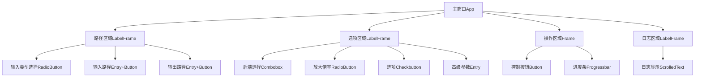
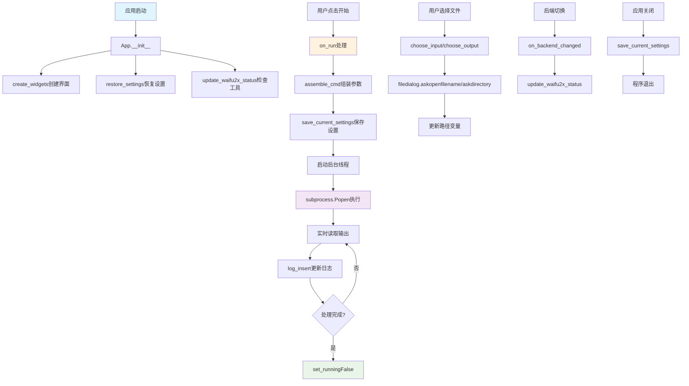

# 文件分析报告：upscaler_gui.py

## 文件概述

`upscaler_gui.py` 是一个基于Tkinter的图形用户界面应用程序，为`upscale_batch.py`命令行工具提供友好的可视化操作界面。该文件实现了完整的桌面GUI应用，包括文件选择、参数配置、进度监控、日志显示等功能，支持本地waifu2x和云端Real-ESRGAN两种AI超分辨率后端。设计注重用户体验和操作便利性，为批量图像处理提供专业的桌面应用解决方案。

## 代码结构分析

### 导入依赖

```python
#!/usr/bin/env python3
# -*- coding: utf-8 -*-
import os, sys, json, threading, subprocess, shlex
from pathlib import Path
import tkinter as tk
from tkinter import ttk, filedialog, messagebox
from tkinter.scrolledtext import ScrolledText
import shutil
```

**依赖分析：**
- **系统库**: os, sys用于系统交互和路径处理
- **并发处理**: threading用于后台任务执行
- **进程管理**: subprocess用于调用命令行工具
- **GUI框架**: tkinter及其扩展组件提供完整GUI支持
- **配置管理**: json用于设置的持久化存储
- **工具函数**: shutil.which用于可执行文件检测

### 全局变量和常量

```python
APP_TITLE = "批量超分前端 · UpScaler GUI"
HERE = Path(__file__).resolve().parent
CLI_SCRIPT = HERE / "upscale_batch.py"
SETTINGS_FILE = HERE / "gui_settings.json"
```

**常量分析：**
- `APP_TITLE`: 应用程序窗口标题
- `HERE`: 当前脚本所在目录的绝对路径
- `CLI_SCRIPT`: 关联的命令行工具路径
- `SETTINGS_FILE`: 用户设置的持久化文件路径

### 配置和设置

- **设置持久化**: 支持用户配置的自动保存和恢复
- **多平台支持**: 兼容Windows、macOS、Linux的文件管理
- **实时状态**: 动态检测外部工具的可用性
- **线程安全**: 使用线程安全的GUI更新机制

## 函数详细分析

### 函数概览表

| 函数名 | 类型 | 主要功能 | 参数数量 | 复杂度 |
|--------|------|----------|----------|--------|
| which | 工具函数 | 检测可执行文件 | 1 | 低 |
| load_settings | 配置函数 | 加载用户设置 | 0 | 低 |
| save_settings | 配置函数 | 保存用户设置 | 1 | 低 |

### 函数详细说明

#### `which(cmd: str) -> str | None`
**功能**: 检测系统中可执行文件的存在性和路径
**实现**: 封装了`shutil.which()`函数，用于检测waifu2x-ncnn-vulkan等外部工具
**返回值**: 可执行文件的完整路径，或None表示未找到

#### `load_settings() -> dict`
**功能**: 从JSON配置文件加载用户设置
**容错机制**: 文件不存在或格式错误时返回空字典
**用途**: 应用启动时恢复用户的上次配置

#### `save_settings(d: dict)`
**功能**: 将用户设置保存到JSON文件
**异常处理**: 写入失败时静默忽略，不影响主要功能

## 类详细分析

### 类概览表

| 类名 | 继承关系 | 主要功能 | 方法数量 | 复杂度 |
|------|----------|----------|----------|--------|
| App | tk.Tk | 主应用程序窗口 | 15+ | 高 |

### 类详细说明

#### `class App(tk.Tk)`
**功能**: 主应用程序类，继承自Tkinter的根窗口类
**设计职责**:
1. **界面构建**: 创建完整的用户界面布局
2. **事件处理**: 处理用户交互和系统事件
3. **进程管理**: 管理后台处理进程的生命周期
4. **状态维护**: 维护应用程序的运行状态

**核心属性**:
```python
self.proc: subprocess.Popen | None = None  # 后台进程
self.running = False                       # 运行状态标志
self.settings = load_settings()           # 用户配置
```

**关键方法分析**:

##### `create_widgets()`
**功能**: 构建完整的用户界面
**布局结构**:
1. **路径区域**: 输入路径和输出路径选择
2. **选项区域**: 后端选择、参数配置
3. **操作区域**: 开始/停止按钮和进度条
4. **日志区域**: 实时日志显示

**界面组件树**:


##### `set_running(flag: bool)`
**功能**: 控制应用程序的运行状态
**状态管理**:
- **UI禁用**: 处理期间禁用所有输入控件
- **进度显示**: 启动/停止进度条动画
- **按钮状态**: 切换开始/停止按钮的可用性

**递归禁用机制**:
```python
def set_children_state(parent, st):
    for child in parent.winfo_children():
        try:
            child.configure(state=st)
        except tk.TclError:
            pass
        set_children_state(child, st)
```

##### `assemble_cmd() -> list[str]`
**功能**: 根据GUI参数组装命令行参数
**参数验证**:
1. **路径检查**: 验证输入路径存在性
2. **目录创建**: 自动创建输出目录
3. **参数组装**: 构建完整的命令行参数列表

**命令构建示例**:
```python
args = [sys.executable, str(CLI_SCRIPT), in_path, out_dir, 
        "--backend", backend, "--scale", scale]
if self.pixel_var.get():
    args.append("--pixel")
```

##### `on_run()`
**功能**: 启动后台处理任务
**执行流程**:
1. **参数验证**: 检查所有必需参数
2. **设置保存**: 持久化当前配置
3. **线程启动**: 在后台线程执行处理任务
4. **状态更新**: 更新UI状态和日志显示

**线程安全处理**:
```python
def worker():
    try:
        self.proc = subprocess.Popen(cmd, stdout=subprocess.PIPE, 
                                   stderr=subprocess.STDOUT, text=True, bufsize=1)
        for line in self.proc.stdout:
            self.log_insert(line)  # 实时显示输出
        code = self.proc.wait()
    finally:
        self.set_running(False)
        self.proc = None
```

##### `restore_settings()` 和 `save_current_settings()`
**功能**: 设置的持久化管理
**配置项目**:
- 路径配置（输入/输出路径）
- 处理参数（后端、倍率、选项）
- 高级设置（waifu2x参数、API密钥）

## 函数调用流程图



## 变量作用域分析

### 类实例作用域
- **UI组件变量**: 所有tkinter变量（StringVar, BooleanVar等）
- **状态控制**: proc, running等进程管理变量
- **配置数据**: settings字典存储用户配置

### 方法局部作用域
- **事件处理方法**: 临时变量用于用户输入处理
- **线程函数**: worker函数中的局部变量
- **参数验证**: 路径检查和命令组装中的临时变量

### 线程共享作用域
- **进程对象**: self.proc在主线程和工作线程间共享
- **GUI更新**: 通过Tkinter的线程安全机制更新界面

## 函数依赖关系

### 内部依赖关系
```
App.__init__ → create_widgets, restore_settings, update_waifu2x_status
on_run → assemble_cmd, save_current_settings, set_running
set_running → 递归遍历所有子组件
choose_input/choose_output → filedialog模块
```

### 外部依赖关系
1. **命令行工具**:
   - upscale_batch.py: 实际的处理逻辑
   - waifu2x-ncnn-vulkan: 本地AI超分工具
2. **系统集成**:
   - 文件系统对话框
   - 进程管理和通信
   - 多平台文件操作
3. **配置持久化**:
   - JSON文件读写
   - 用户目录访问权限

### 数据流分析
```
用户输入 → GUI组件 → 内部状态变量 → 命令行参数 → 子进程执行 → 结果反馈 → GUI更新
```

## 错误处理和用户体验

### 异常处理策略
1. **用户输入验证**: 路径有效性、参数完整性检查
2. **文件系统错误**: 权限不足、路径不存在的处理
3. **进程异常**: 子进程崩溃的恢复机制
4. **配置错误**: 设置文件损坏的降级处理

### 用户体验优化
```python
# 友好的错误提示
try:
    cmd = self.assemble_cmd()
except ValueError as e:
    messagebox.showerror("参数错误", str(e))
    return

# 实时进度反馈
self.log_insert("▶️ 开始执行：\n" + " ".join(shlex.quote(x) for x in cmd) + "\n")
self.set_running(True)
```

## 性能和响应性

### 性能特性
1. **非阻塞UI**: 使用线程避免界面冻结
2. **实时反馈**: 流式显示处理进度
3. **内存效率**: 流式读取子进程输出，避免大量缓存
4. **响应性**: 保持GUI在处理期间的响应能力

### 线程管理
- **后台处理**: 计算密集型任务在独立线程执行
- **GUI更新**: 通过Tkinter的线程安全机制更新界面
- **进程控制**: 支持用户中断长时间运行的任务

## 平台兼容性

### 多平台支持
```python
def open_output(self):
    out_dir = self.out_path_var.get().strip()
    if sys.platform == "darwin":
        subprocess.run(["open", out_dir])          # macOS
    elif os.name == "nt":
        os.startfile(out_dir)                      # Windows
    else:
        subprocess.run(["xdg-open", out_dir])      # Linux
```

### 主题适配
```python
# macOS原生主题支持
style = ttk.Style()
if "aqua" in style.theme_names():
    style.theme_use("aqua")
style.configure("Success.TButton", font=("Helvetica", 12, "bold"))
```

## 安全性考虑

### 安全特性
1. **参数验证**: 防止命令注入攻击
2. **路径检查**: 验证文件路径的有效性和安全性
3. **进程隔离**: 使用subprocess安全执行外部程序
4. **权限控制**: 检查文件系统访问权限

### 配置安全
- **敏感信息**: API密钥等敏感信息的安全处理
- **文件权限**: 配置文件的适当权限设置
- **输入过滤**: 用户输入的安全过滤和验证

## 代码质量评估

### 优点
1. **结构清晰**: MVC模式的良好实践，界面与逻辑分离
2. **用户友好**: 直观的界面设计和完善的错误提示
3. **功能完整**: 覆盖命令行工具的所有功能
4. **可维护性**: 模块化设计便于功能扩展和维护

### 改进建议
1. **配置管理**: 可考虑使用更结构化的配置格式
2. **国际化**: 支持多语言界面
3. **插件系统**: 支持自定义处理插件
4. **性能监控**: 添加处理时间和资源使用监控

## 总结

`upscaler_gui.py` 是一个设计精良、功能完整的桌面GUI应用程序。成功地将复杂的命令行工具包装为用户友好的图形界面，同时保持了功能的完整性和性能的高效性。代码体现了现代桌面应用开发的最佳实践，在用户体验、错误处理、平台兼容性等方面都表现出色。该应用为非技术用户提供了专业级AI图像处理工具的便捷访问方式，是GUI应用开发的优秀范例。