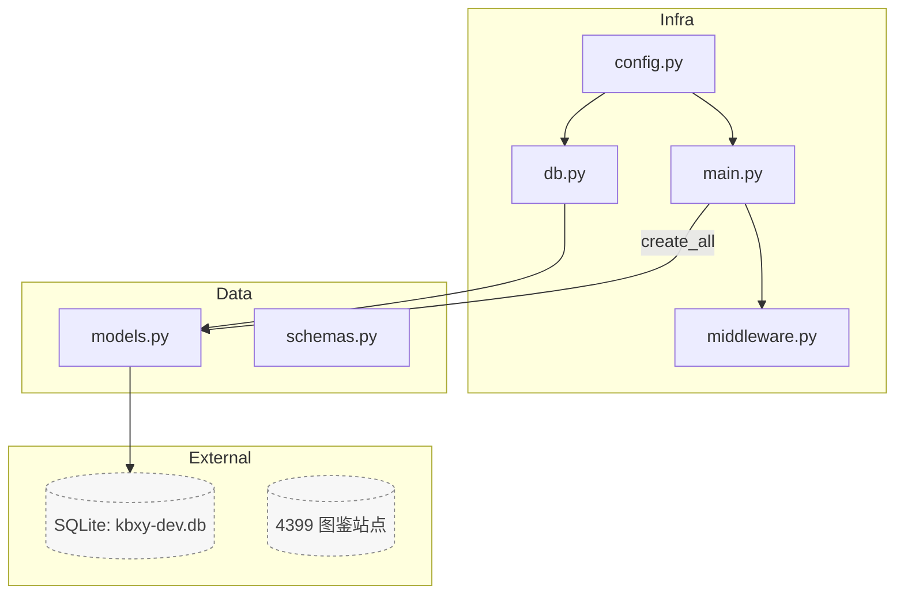
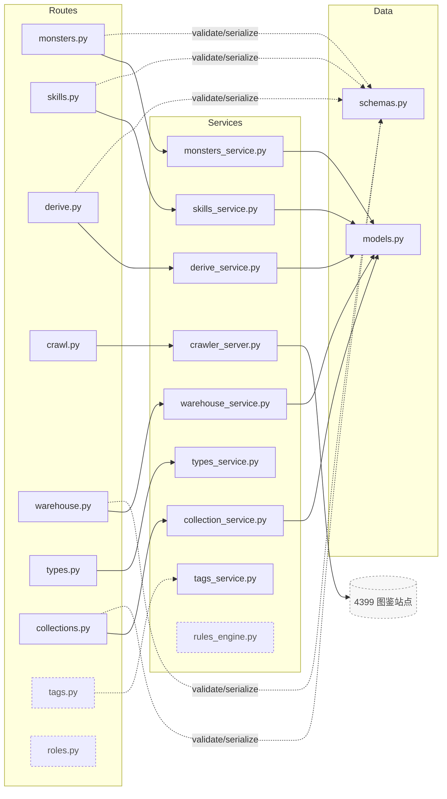
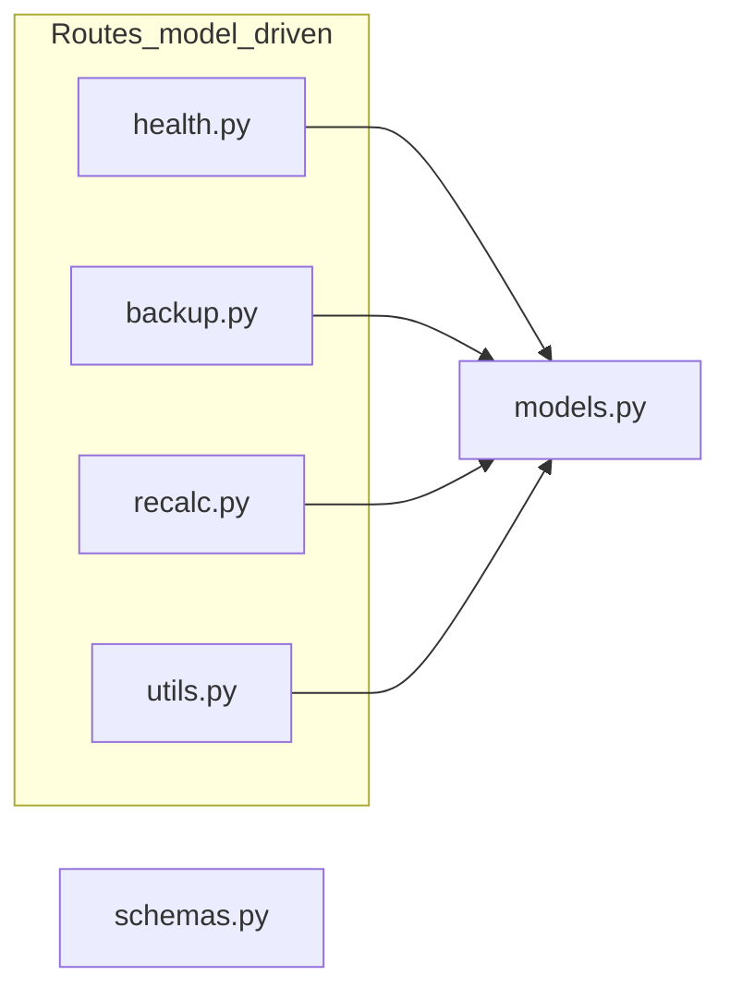
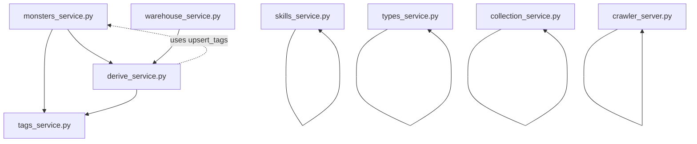

没问题！我把你的**三张小图**和**逐文件关系说明**都按“已删除 `import_service` / `routes/importing.py`”与当前服务依赖关系**全面更新**了；并新增一张**服务内部依赖小图**，把 `derive/tags/warehouse/monsters` 之间的调用链讲清楚。所有图均 **Mermaid v11 兼容**、块小且清晰。

---

## 小图 1 · 核心装配（Infra / Data / External）

---

## 小图 2A · 成对映射（路由 → 服务 → 数据）

---

## 小图 2B · 模型/工具直连的路由（更紧凑）

---

## 小图 3 · 服务内部依赖（谁调用谁）
> 只展示**跨服务**依赖，避免线太多；虚线代表“运行时调用/避免循环导入”。

---

# 文字说明 · 文件与文件的关系（全量，已更新）

> 记号：**→**“依赖/调用”；**⇢**“被……使用”；**（可选）**存在即挂载、缺失不报错。

## Infra 层
- `config.py`  
  提供全局 `Settings/settings`；**被** `db.py`（DB URL/路径）、`main.py`（app 名/CORS）使用。
- `db.py`  
  依赖 `config.py`；提供 `engine/SessionLocal/Base`（开启 WAL、FK）；**被** `models.py`、各服务/路由使用。
- `middleware.py`  
  提供 `TraceIDMiddleware`；**被** `main.py` 挂载；服务/路由可经 `request.state.trace_id` 贯穿日志。
- `main.py`  
  依赖 `config.py/db.py/middleware.py`；集中 `include_router(...)`；一次性 `create_all`；作为 Uvicorn 入口。

## Data 层
- `models.py`  
  基于 `Base` 定义 ORM：`Monster/MonsterDerived/Tag/Skill/MonsterSkill/Collection/CollectionItem` 等；**被**所有服务与部分路由使用；落地 SQLite。
- `schemas.py`  
  Pydantic v2 请求/响应模型；**被**各路由用于校验与序列化（服务层也可作类型提示）。

## Services 层
- `monsters_service.py`  
  提供怪物列表/筛选/标签写回（与 `derive_service` 联动）；**依赖** `models.py`、**调用** `derive_service`、`tags_service`。
- `skills_service.py`  
  提供技能唯一 upsert、轻量文本标签提取；**依赖** `models.py`。
- `derive_service.py`  
  计算派生五系与定位、可写回 `MonsterDerived` 与 `monster.role`；**依赖** `models.py`、**调用** `tags_service.extract_signals`；在补标签路径**运行时调用** `monsters_service.upsert_tags`（避免循环导入）。
- `crawler_server.py`  
  4399 图鉴抓取与字段规范化，产出轻量 JSON；主要外部依赖 `DrissionPage/requests/bs4`；通常由 `routes/crawl.py` 使用（是否落库由路由决定）。
- `warehouse_service.py`  
  维护拥有状态与仓库列表/统计；**依赖** `models.py`，在需要时**调用** `derive_service` 校准派生（推荐仅在显式开关/后台任务中启用）。
- `collection_service.py`  
  收藏夹 CRUD 与批量成员维护；**依赖** `models.py`。
- `types_service.py`  
  读取 `data/type_chart.json`，提供属性克制查询/卡片/矩阵；无 DB 依赖；**被** `routes/types.py` 使用。
- `tags_service.py`  
  标签目录热更新、正则/AI 打标、信号抽取；**被** `derive_service` 与可能的 `routes/tags.py` 使用。
- `rules_engine.py`（可选）  
  线性权重的粗分标签与解释；在现有架构中**非核心**（保留以兼容历史工具或快速打标）。

## Routes 层（按是否主要经由服务层）
- **服务驱动的路由**（见小图 2A）  
  - `routes/monsters.py` → `monsters_service.py` → `models.py`（结合 `schemas.py`）  
  - `routes/skills.py`   → `skills_service.py`   → `models.py`  
  - `routes/derive.py`   → `derive_service.py`   → `models.py`  
  - `routes/crawl.py`    → `crawler_server.py`   （可选择落 `models`）  
  - `routes/warehouse.py`→ `warehouse_service.py`→ `models.py`  
  - `routes/types.py`    → `types_service.py`  
  - `routes/collections.py` → `collection_service.py` → `models.py`  
  - `routes/tags.py`（可选）→ `tags_service.py`（或直接 `models.py` 做聚合）
- **模型/工具直连的路由**（见小图 2B）  
  - `routes/health.py` / `routes/backup.py` / `routes/recalc.py` / `routes/utils.py` → 直接读写 `models.py` 或调用轻量工具

---

## 端到端调用示例（已去除导入链路）
1) **列出怪物（GET /monsters）**  
`monsters.py` → `monsters_service.list_monsters(...)` → 读 `models.Monster`（必要的关联 `selectinload`）→ `schemas.MonsterList` 返回。

2) **批量设置拥有（POST /warehouse/bulk_set）**  
`warehouse.py` → `warehouse_service.bulk_set_warehouse(ids, possess)` → 写 `Monster.possess`；（可选）显式触发派生重算任务。

3) **重算派生（POST /derive/recompute?id=...）**  
`derive.py` → `derive_service.recompute_and_autolabel(db, monster)` → 写/更新 `MonsterDerived` 与 `monster.role`。

4) **抓取单页（POST /crawl/fetch_one）**  
`crawl.py` → `crawler_server.fetch_detail(url)` → 返回轻量 JSON（是否落库由路由决定）。

5) **收藏夹成员覆盖（POST /collections/bulk_set）**  
`collections.py` → `collection_service.bulk_set_members(...)` → 写 `CollectionItem`（幂等 + 去重 + 一次重试）。

---